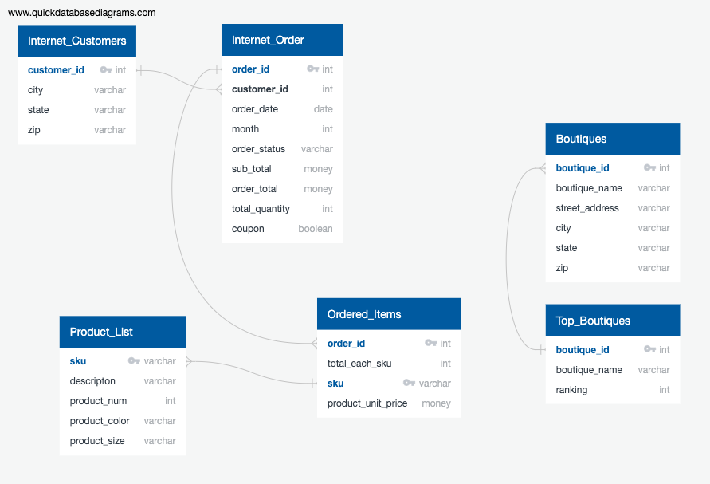

# Body-Bark-ETL Project

# Project Requirements 
The requirements of this team project was to collect two or more datasets, perform ETL on the data, and produce a final technical report outlining our project motivation, data sources, justification for the chosen data structure, and use cases for how the data could be utilized by the end user. 

# Project Purpose and Data Sources
The purpose of our project was to prepare Body Bark [Body Bark](https://www.bodybark.com) data for future analysis and data retrievel. Working with Python and SQL, specifically Postgres, we converted csv files taken from two different Body Bark data sources (BigCommerce and Quickbooks) into a newly mapped relational database. 

# ETL Overview
* **E**xtract: We extracted our data as CSV files from BigCommerce and Quickbooks. BigCommerce provided us data on internet customers and sales and Quickbooks provided us data on Boutique customers and orders. The CSV files can be found in the Outputs folder. 

We then created a schema using QuickERD tool in order to identify Primary and Foreign Keys. 

* **T**ransform: The transformation of all csv files was done using the Pandas library available to Python in Jupyter Notebook. The code for transfroming the data of each table is found in the respective .ipynb files. 

* **L**oad: The newly cleaned data (generated by to_csv method in Python) was loaded into Postgres.  

# Final Conclusions
In conlusion, the transformed data will be useful for providing future insights into Body Bark’s marketing, as well as providing several new opportunites to easily query on useful data for further analysis.  

# About Body Bark
Body Bark [Body Bark](https://www.bodybark.com) is a sustainable clothing company. Founder Catherine Poirier built her company with the goal of creating a fashionable underlayer that could stand the test of time and was sustainabilty sourced and manufactred. Body Bark products are made using MircoModal® of Lenzing Ag, a sustainable fabric made from the cellulose fiber of sustainabily harvevsted Beech trees. And, because all Body Bark products are manufactured using closed-loop manufacturing, there are no unused byproducts in the maufacturing process, making all Body Bark products biodegradable. Body Bark products are proudly "Made in the USA". 